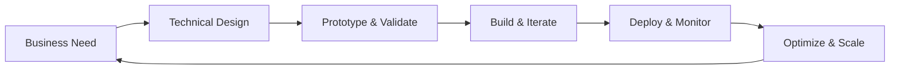

# 👋 Hello, I'm Collins Nyamao

## 🚀 Senior Solutions Architect | Product Manager | Full-Stack Developer

> Building scalable, intelligent systems that bridge technical excellence with business value across multiple industries.

### 💫 About Me

I'm a senior technical leader who combines hands-on development with platform engineering and AI integration. I write production code, architect cloud-native infrastructures, and drive product strategy from concept to scale. My unique value lies in bridging the gap between writing elegant code and building resilient platforms that deliver measurable business outcomes.

```typescript
const profile = {
  roles: ['Solutions Architect', 'Product Manager', 'Full-Stack Developer'],
  experience: 'Senior Level',
  approach: 'End-to-end ownership from code commits to cloud infrastructure',
  passion: 'Transforming ideas into scalable platforms that make a difference'
};
```

### 🛠️ Technical Stack

#### **Languages & Frameworks**


#### **Cloud & Infrastructure**


#### **Platform Engineering & DevOps**


#### **AI/ML & Data**


### 🎯 Core Competencies

```yaml
Architecture:
  - Cloud-Native Design (Microservices, Event-Driven, Serverless)
  - Infrastructure as Code (Terraform, CloudFormation)
  - Service Mesh & API Gateway Patterns
  - Observability & Monitoring Stacks
  - Security-First Architecture

Development:
  - Full-Stack Web Applications
  - RESTful & GraphQL APIs
  - Real-time Systems (WebSockets, SSE)
  - Test-Driven Development
  - CI/CD Pipeline Implementation

Product Management:
  - Strategic Roadmapping
  - Stakeholder Management
  - Agile/Scrum Leadership
  - Data-Driven Decision Making
  - Cross-functional Team Leadership

AI/ML Integration:
  - LLM Implementation & Fine-tuning
  - ML Pipeline Architecture
  - Intelligent Automation
  - Vector Databases & RAG Systems
```

### 📊 Industry Experience

<table>
  <tr>
    <td align="center">💰<br><strong>Fintech</strong><br>Payment Systems<br>Risk Management<br>Compliance</td>
    <td align="center">🌾<br><strong>Agritech</strong><br>IoT Integration<br>Supply Chain<br>Data Analytics</td>
    <td align="center">🏥<br><strong>Healthtech</strong><br>HIPAA Compliance<br>Telemedicine<br>ML Diagnostics</td>
    <td align="center">🚀<br><strong>Enterprise</strong><br>Digital Transformation<br>Legacy Migration<br>Scale Solutions</td>
  </tr>
</table>

### 🏗️ What I Build

- **🔧 Self-Service Developer Platforms**: Kubernetes-based platforms with automated provisioning, monitoring, and deployment pipelines
- **🤖 AI-Powered Applications**: LLM-integrated systems with RAG, intelligent automation, and ML pipelines
- **☁️ Cloud-Native Architectures**: Scalable microservices, event-driven systems, and serverless applications
- **📊 Data Platforms**: Real-time processing pipelines, analytics systems, and observability stacks
- **🔐 Secure Enterprise Solutions**: Zero-trust architectures, compliance-ready systems, and encrypted data flows

### 📈 My Approach



### 🌟 Key Achievements

- 🚀 Architected platforms handling **1M+ daily transactions** with 99.9% uptime
- 💡 Reduced infrastructure costs by **40%** through optimization and automation
- 🏃 Accelerated deployment cycles from weeks to **hours** with GitOps
- 🤝 Led cross-functional teams of **20+ engineers** across multiple time zones
- 📊 Improved system observability resulting in **60% faster** incident resolution

### 💻 Recent Projects

#### 🏦 **Enterprise Payment Platform**
- Built event-driven microservices architecture processing $10M+ daily
- Implemented real-time fraud detection using ML models
- Tech: Kubernetes, Kafka, Python, React, AWS

#### 🌾 **AgriTech IoT Platform**
- Designed scalable IoT data ingestion for 100K+ devices
- Built predictive analytics for crop yield optimization
- Tech: Serverless, TimeSeries DB, Node.js, Terraform

#### 🏥 **Healthcare AI Assistant**
- Integrated LLMs for intelligent patient triage
- Ensured HIPAA compliance with encrypted data pipelines
- Tech: OpenAI, Vector DB, FastAPI, Next.js

### 📚 Continuous Learning

Currently exploring:
- 🔮 Advanced RAG techniques and multi-agent systems
- 🌐 Edge computing and distributed architectures
- 🔧 Platform engineering best practices
- 🧪 Chaos engineering and resilience patterns

### 🤝 Let's Connect!

- 💼 [LinkedIn](https://linkedin.com/in/collinsnyamao)
- 🐦 [Twitter](https://twitter.com/nyamaocollins)
- 📧 [Email](mailto:nyamaocollins@outlook.com)
- 🌐 [Portfolio](https://collinsnyamao.com)
- 📝 [Blog](https://blog.collinsnyamao.com)

### 📊 GitHub Stats

<p align="center">
  
</p>

<p align="center">
  
</p>

### 🎯 Current Focus

```javascript
const currentFocus = {
  building: "AI-powered developer productivity tools",
  learning: "Advanced Kubernetes operators",
  contributing: "Open-source observability projects",
  mentoring: "Junior developers in cloud-native practices"
};
```

---

<p align="center">
  <i>🚀 Transforming ideas into scalable, intelligent systems that deliver real business value</i>
</p>

<p align="center">
  
</p>